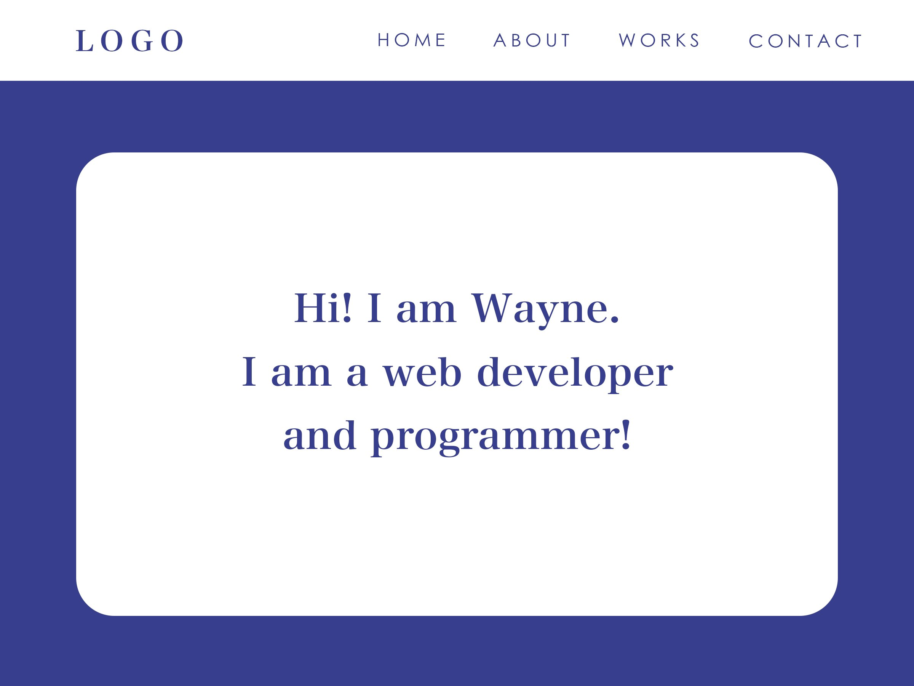

# Portfolio Project

### Project Description
Front-end portfolio project that is built from scratch using react.

### Installation Process
1. Navigate to the place where you want to clone the project in the terminal and do: `git clone {this repo's url}`.
2. cd into the cloned project.
3. Download the dependency using: `npm install`.
4. Run the program using: `npm start`.

### Deployment
https://wayne-portfolio.netlify.app/

### Prototype

##### Home Page
Basically a landing page, show short description of myself.

##### About Page
More detail regarding myself and my background, probably will put stuff like education background here.

##### Project Page
Page displaying all the project that have been work on before. Show image of what the project looks like which can be clicked into to show more detail of the project.

##### Contact Page
For contacting me. Should include validation for the form.

### Resources for Inspiration

(Just used the one provided in the project requirement)

https://www.freecodecamp.org/news/15-web-developer-portfolios-to-inspire-you-137fb1743cae/

https://www.springboard.com/blog/programmer-portfolio/#:~:text=At%20the%20very%20least%2C%20a,to%20go%20in%20your%20career.

https://skillcrush.com/blog/web-developer-portfolios/

https://www.sitepoint.com/how-to-build-a-stunning-portfolio-website-as-a-web-developer/